# Maquette

1- Page pricipale

2- About me : using Aceternity UI Timeline component for Experience

<!-- Only the picture design -->
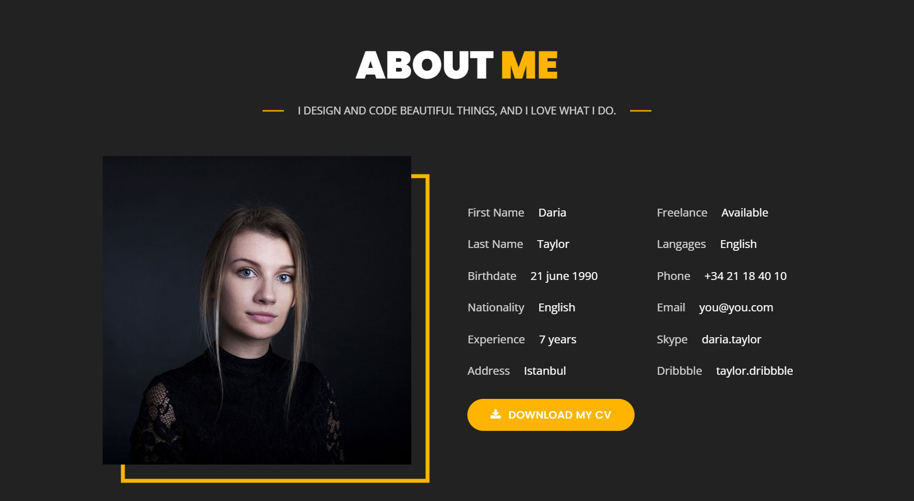

<!-- 
1- The description
2- The sticky effet
3- The Experience details
4- Contact button
 -->
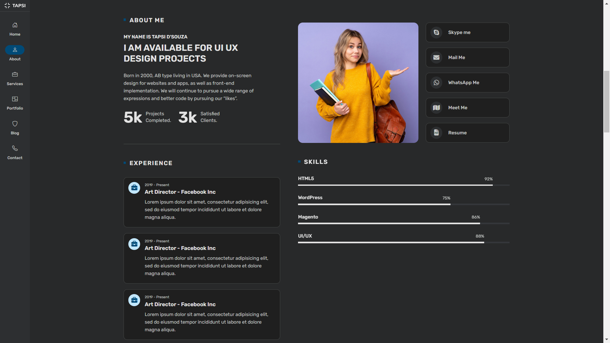

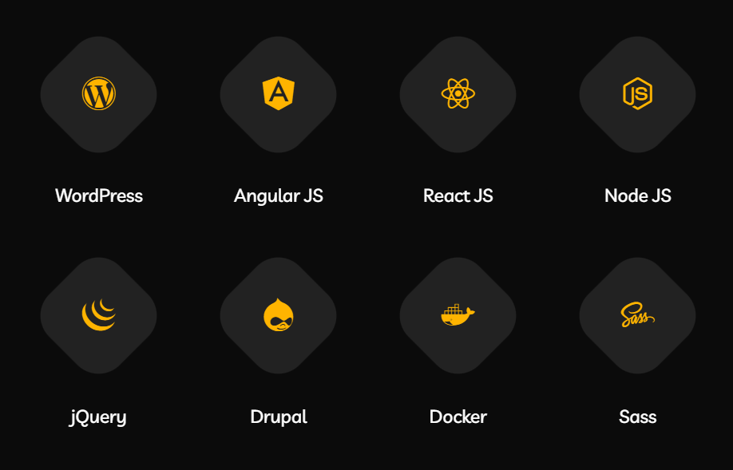

3- Services

<!--
1- The animation
2- The service card structure
-->
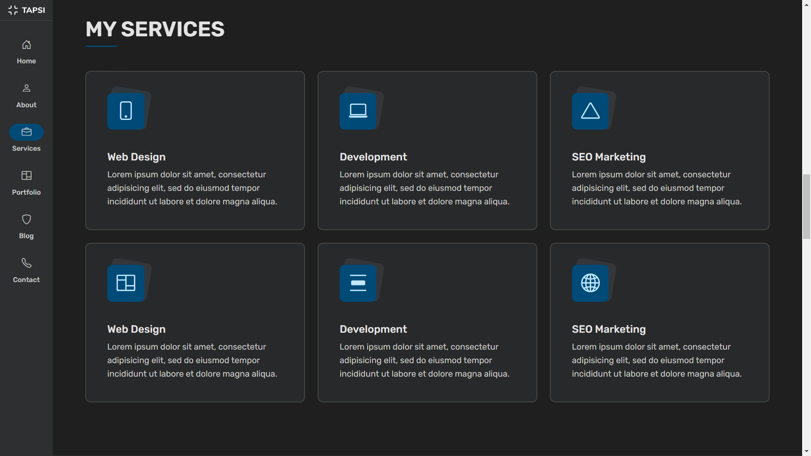

4- Portfolio : using the Aceternity UI Service Card & Carousel component for Animation

<!--
1- The animation
2- The details popup structure and animation
-->
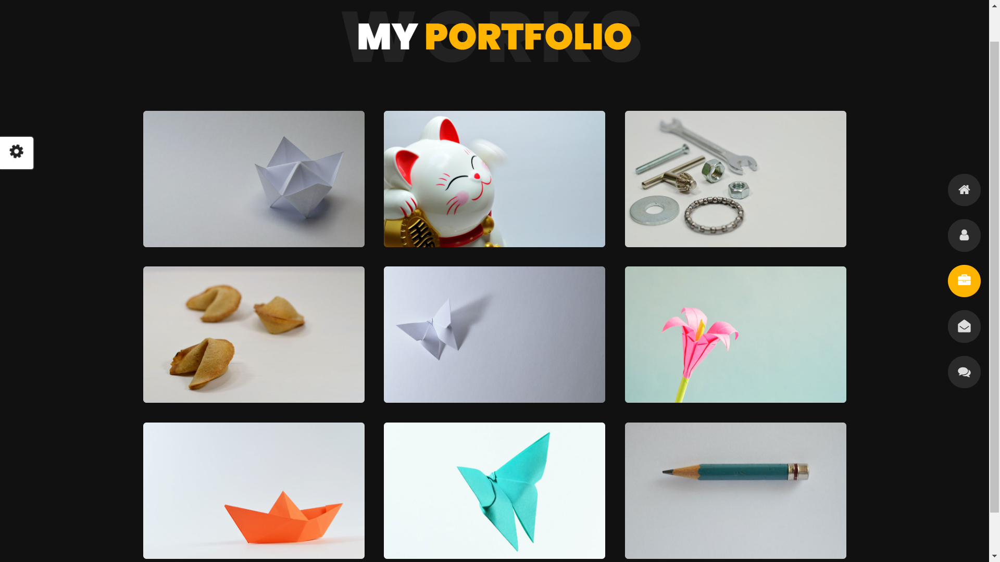

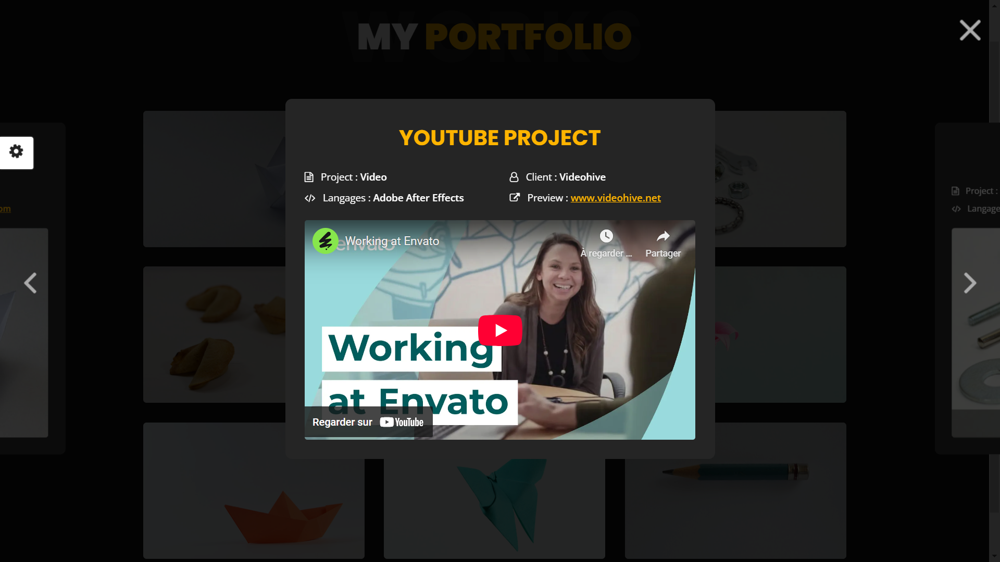

<!-- The portfolio card structure -->
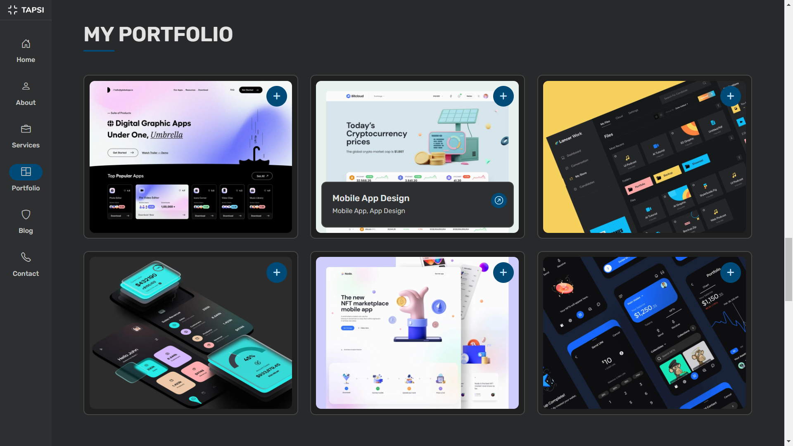

<!-- The animation -->

5- Testimonials

<!-- Animation and card structure -->
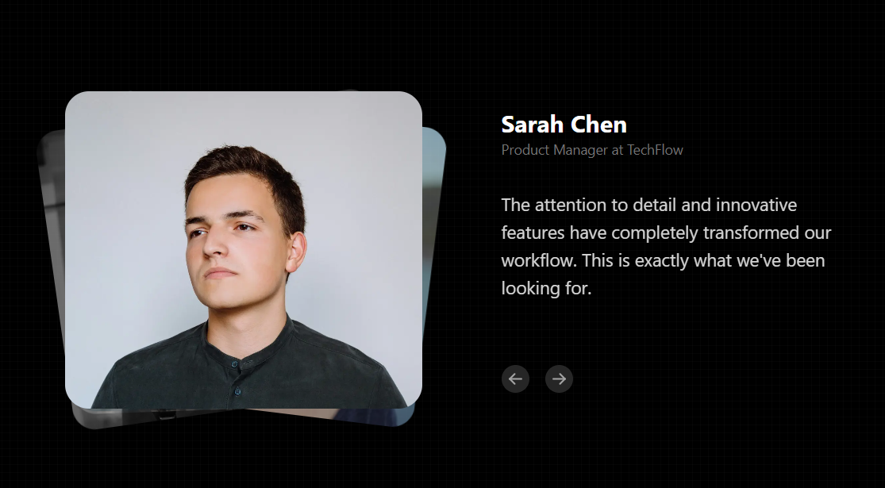

6- Blog

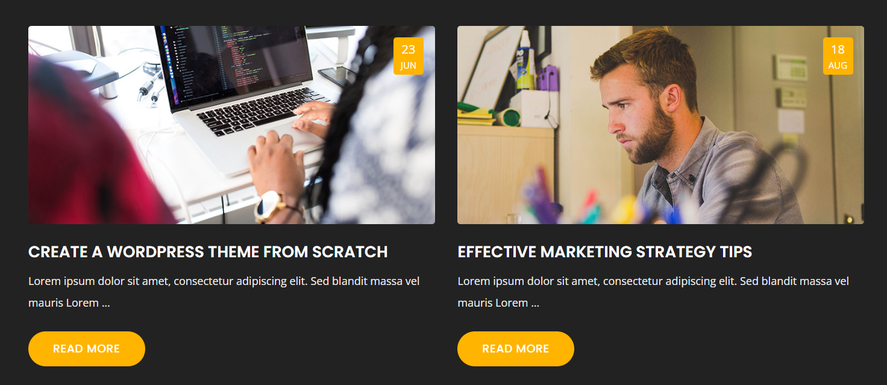

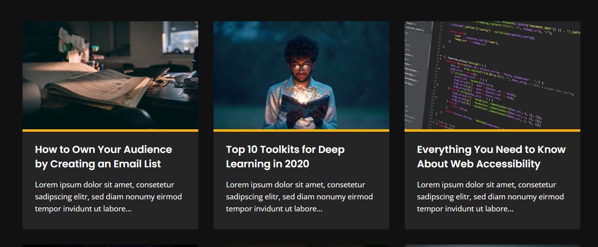

7- Contact

8- Footer

<!--
1- The animation
2- The footer card structure
-->
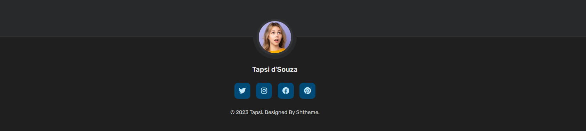
